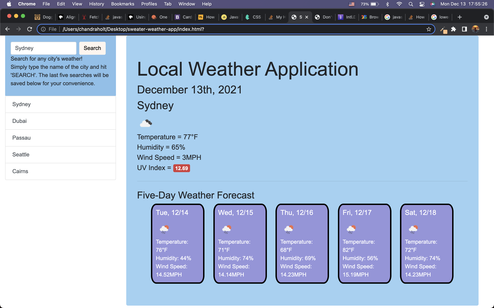

## Sweater Weather App

[Deployed Application](https://chandrapanda.github.io/sweater-weather-app/)

Weather dashboard to retrieve weather data for cities around the world. User may type a city name in search bar and see the weather for the given city, as well as the date and a five-day forecast. The UV index is displayed with a color code regarding ideal, moderate, or severe conditions. After the user searches for a city, that city is added to a history bar on the left side of the screen for later use, if desired. When user clicks the previous city name, it appears on top of the list and displays the weather information for that city again. 




## Technologies Used
* JavaScript
* HTML
* CSS
* Bootstrap API
* OpenWeather API

## User Story

```
AS A traveler
I WANT to see the weather outlook for multiple cities
SO THAT I can plan a trip accordingly
```

## Acceptance Criteria

```
GIVEN a weather dashboard with form inputs
WHEN I search for a city
THEN I am presented with current and future conditions for that city and that city is added to the search history
WHEN I view current weather conditions for that city
THEN I am presented with the city name, the date, an icon representation of weather conditions, the temperature, the humidity, the wind speed, and the UV index
WHEN I view the UV index
THEN I am presented with a color that indicates whether the conditions are favorable, moderate, or severe
WHEN I view future weather conditions for that city
THEN I am presented with a 5-day forecast that displays the date, an icon representation of weather conditions, the temperature, the wind speed, and the humidity
WHEN I click on a city in the search history
THEN I am again presented with current and future conditions for that city
```
## License
* MIT

## Contact
https://github.com/chandrapanda/
